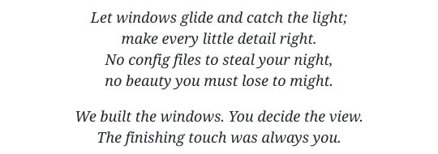

<h1 align="center">
  <picture>
    <source media="(prefers-color-scheme: dark)" srcset="assets/branding/denial-dark.svg">
    
  </picture>
</h1>

<p align="center"><strong>A Wayland compositor. We got a little carried away.</strong></p>

<p align="center">
  <a href="https://github.com/denialwm/denial/tags"></a>
  <a href="https://github.com/denialwm/denial/actions/workflows/branch-validation.yml?query=branch%3Amain"></a>
  <a href="LICENSE"></a>
  <a href="https://sponsor.denialwm.org/en"></a>
</p>

<p align="center"><strong>English</strong> | <a href="README.zh-CN.md" lang="zh-CN">简体中文</a></p>

<p align="center">
  <picture>
    <source media="(prefers-color-scheme: dark)" srcset="assets/branding/poem-dark.svg">
    
  </picture>
</p>

<p align="center">
  <a href="#install">Install</a> ·
  <a href="#edit-the-shell">Edit the shell</a> ·
  <a href="docs/README.md">Documentation</a>
</p>

https://github.com/user-attachments/assets/2c7335bb-7363-46b1-8e3a-0d98c36c64b1

## Features

- Stacking, tiling, and scrolling tiling layouts.
- Workspaces and touchpad gestures. Plenty of room for projects you'll
  definitely finish someday.
- Smooth animations and transitions.
- Blur and customizable glass. Subtlety is available in Settings.
- Light and dark themes. Pick an accent color or borrow one from your wallpaper.
- Settings for layouts, displays, input, shortcuts, and appearance.
  It's a desktop. You should be able to configure it with a mouse.
- [Live shell editing and hot reload](#edit-the-shell).
- Wayland and X11 apps (through Xwayland), multiple monitors, screenshots,
  and screen sharing.

Hyprland and niri users are welcome. We won't tell.

| Glass dashboard | Another mood |
| --- | --- |
| [](assets/screenshots/glass-dashboard.png) | [](assets/screenshots/desktop-purple.png) |
| **Launcher, up close** | **Wuthering Waves, with company** |
| [](assets/screenshots/glass-launcher.png) | [](assets/screenshots/wuthering-waves.png) |

## Support Denial

There are easier hobbies than writing a compositor. Unfortunately, we like this one.

If you like where Denial is going, help fund its development.

**[Sponsor Denial](https://sponsor.denialwm.org/en)**

## Install

Denial is in **public beta**. It runs on Linux. Someone got it running on
StarryOS's [starry-kernel](https://github.com/rcore-os/tgoskits/tree/dev/os/StarryOS/kernel)
too. Apparently one kernel wasn't enough.
Linux builds support **x86-64 and ARM64**.
Configuration and developer interfaces may change before 1.0.

First-party Linux binary packages are currently x86-64. For the distributions below,
review the [repository setup script](install.sh), then add the signed repository:

```sh
curl -fsSL https://install.denialwm.org | sh
```

Setup shows its plan and asks for confirmation before using `sudo`. Once it
finishes, install Denial with the command for your distribution:

| Distribution | Install |
| --- | --- |
| Arch Linux / CachyOS / Omarchy 4.0 | `sudo pacman -Syu denial` |
| Debian 13 / Ubuntu 24.04 LTS | `sudo apt update && sudo apt install denial` |
| Fedora 44 | `sudo dnf install denial` |

Alpine Linux 3.24 has [signed APK downloads](docs/INSTALL.md#alpine-linux-324).
ARM64 builds are supported [from source](docs/BUILDING.md); NixOS and Void Linux
have also been tested, with no first-party binaries yet.

After installing, choose **Denial** from your display manager's session menu.

[Installation, updates, and removal](docs/INSTALL.md) ·
[Session setup and renderer options](docs/SESSION_STARTUP.md)

## Edit the shell

The shell's UI is editable Flutter code. With the development tools installed,
change a widget, save, and watch your desktop update while your Wayland apps
keep running. Try to remember what you were supposed to be working on.

The optional `denial-ui-development` package is available only through the
Pacman repository:

```sh
sudo pacman -S denial-ui-development
denialctl ui setup
```

Open the generated workspace's `dart_shell` directory in VSCodium for hot reload
on save. If an edit goes wrong, `denialctl ui restore` gets you back to the
packaged shell, even when Settings can't open.

[Live development guide](docs/UI_DEVELOPMENT.md) ·
[Custom shell framework](docs/CUSTOM_SHELLS.md)

## Under the hood

Rust and Smithay handle Wayland, input, and displays. Flutter draws the shell
and application windows together. Yes, that Flutter. It got promoted.

[Explore the architecture](docs/architecture.md) ·
[Build from source](docs/BUILDING.md)

## Why Denial

**Denial** is an English word. The name contains **Denia**, followed by one
last letter.

It is a quiet reference to Denia from *Wuthering Waves*. Her story never gives
a simple answer to what she originally was, and that uncertainty is important.
What is clear is that others treated her as an asset: something selected,
shaped, and assigned a purpose that was not her own. She was meant to remain a
vessel. Instead, by observing people and learning to live among them, she grew
a heart and gained the ability to choose what she would become.

Her story reflects Denial's central idea: what something was made to be does
not have to determine what it can become.

## Made through dialogue

Denial was conceived, architected, directed, and tested by Doctor Logix, and
developed in continuous collaboration with OpenAI Codex. Its initial
implementation was generated through that dialogue.

Doctor Logix made the design and technical decisions, tested the results on
real hardware, and sent the work back when it wasn't right. Codex investigated
problems, proposed solutions, and wrote the code.

Authorship is more than typing source code.

## Documentation

[All guides](docs/README.md) · [Control and recovery](docs/DENIALCTL.md) ·
[Screenshots and screen sharing](docs/SCREEN_CAPTURE.md)

[Changelog](CHANGELOG.md) · [Roadmap](ROADMAP.md) ·
[Contributing](CONTRIBUTING.md) · [Security](SECURITY.md)

## License

Denial's original source code is licensed under
[GPL-3.0-or-later](LICENSE). Bundled third-party components and media retain
their own licenses and attribution notices.
