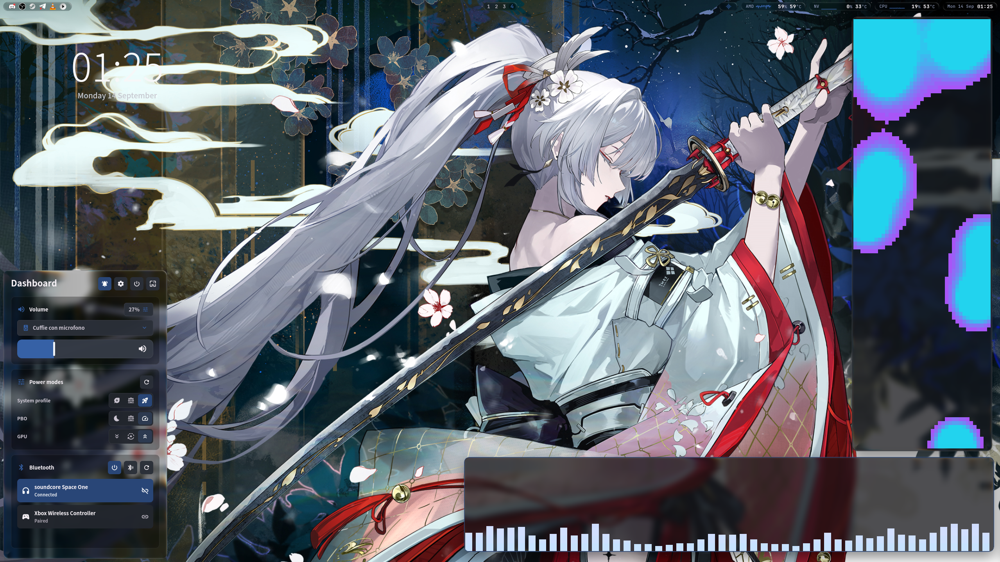
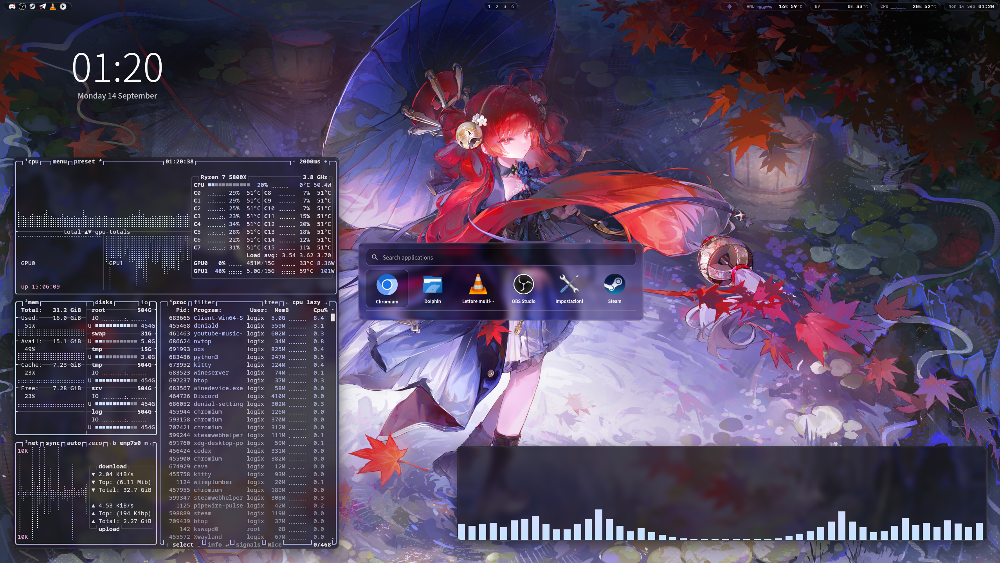
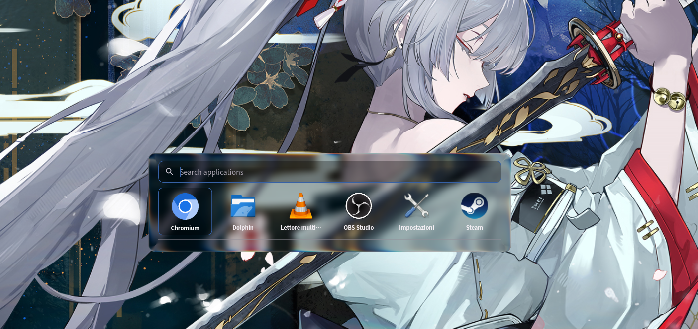
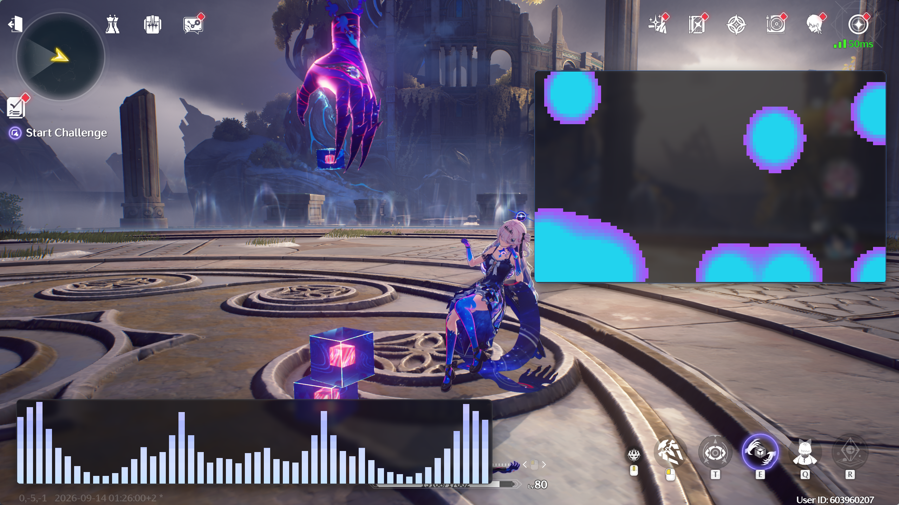

<h1 align="center">
  <picture>
    <source media="(prefers-color-scheme: dark)" srcset="assets/branding/denial-dark.svg">
    
  </picture>
</h1>

<p align="center"><strong>一个 Wayland 合成器。写着写着，有点上头了。</strong></p>

<p align="center">
  <a href="https://github.com/denialwm/denial/tags"></a>
  <a href="https://github.com/denialwm/denial/actions/workflows/branch-validation.yml?query=branch%3Amain"></a>
  <a href="LICENSE"></a>
  <a href="https://sponsor.denialwm.org/cn"></a>
</p>

<p align="center"><a href="README.md" lang="en">English</a> | <strong>简体中文</strong></p>

<p align="center">
  <picture>
    <source media="(prefers-color-scheme: dark)" srcset="assets/branding/poem-zh-CN-dark.svg">
    
  </picture>
</p>

<p align="center">
  <a href="#安装">安装</a> ·
  <a href="#修改桌面外壳">修改桌面外壳</a> ·
  <a href="docs/README.md">文档</a>
</p>

https://github.com/user-attachments/assets/2c7335bb-7363-46b1-8e3a-0d98c36c64b1

## 功能

- 堆叠、平铺、滚动平铺三种窗口布局。
- 工作区和触控板手势。你那些“总有一天会做完”的项目，这下都有地方放了。
- 流畅的动画与过渡效果。
- 模糊与可自定义的玻璃效果。想低调一点，去设置里调。
- 浅色和深色主题。强调色可以自己选，也可以从壁纸里取。
- 布局、显示器、输入、快捷键和外观，都能在设置里改。
  桌面嘛，用鼠标就该能配置。
- [实时修改桌面外壳与热重载](#修改桌面外壳)。
- 支持 Wayland 和 X11 应用（通过 Xwayland）、多显示器、截图及屏幕共享。

欢迎 Hyprland 和 niri 用户。我们不会说出去的。

| 玻璃控制面板 | 换个心情 |
| --- | --- |
| [](assets/screenshots/glass-dashboard.png) | [](assets/screenshots/desktop-purple.png) |
| **启动器，凑近看看** | **《鸣潮》，还有点别的** |
| [](assets/screenshots/glass-launcher.png) | [](assets/screenshots/wuthering-waves.png) |

## 支持 Denial

比写合成器省心的爱好多的是。偏偏我们就喜欢这个。

如果你喜欢 Denial 的发展方向，欢迎赞助开发。

**[赞助 Denial](https://sponsor.denialwm.org/cn)**

## 安装

Denial 目前处于**公开测试阶段**，运行于 Linux。还有人把它跑在了
StarryOS 的 [starry-kernel](https://github.com/rcore-os/tgoskits/tree/dev/os/StarryOS/kernel)
上。看来一个内核还不够。
Linux 构建支持 **x86-64 和 ARM64**。
在 1.0 之前，配置和开发接口可能会发生变化。

目前官方 Linux 二进制软件包仅提供 x86-64 版本。对于下列发行版，
请先查看[软件源配置脚本](install.sh)，再添加已签名的软件源：

```sh
curl -fsSL https://install.denialwm.org | sh
```

脚本会展示将要执行的操作，并在使用 `sudo` 前请求确认。
完成后，运行对应发行版的命令来安装 Denial：

| 发行版 | 安装命令 |
| --- | --- |
| Arch Linux / CachyOS / Omarchy 4.0 | `sudo pacman -Syu denial` |
| Debian 13 / Ubuntu 24.04 LTS | `sudo apt update && sudo apt install denial` |
| Fedora 44 | `sudo dnf install denial` |

Alpine Linux 3.24 提供[已签名的 APK 软件包下载](docs/INSTALL.md#alpine-linux-324)。
ARM64 支持[从源码构建](docs/BUILDING.md)；NixOS 和 Void Linux 也经过测试，
但目前没有官方二进制软件包。

安装完成后，在显示管理器的会话菜单中选择 **Denial**。

[安装、更新与卸载](docs/INSTALL.md) ·
[会话设置与渲染器选项](docs/SESSION_STARTUP.md)

## 修改桌面外壳

桌面外壳的界面就是可编辑的 Flutter 代码。安装开发工具后，改一个组件，保存，
就能看到桌面更新，Wayland 应用照常运行。别忘了你原本是打开电脑来干什么的。

可选的 `denial-ui-development` 软件包仅在 Pacman 软件源中提供：

```sh
sudo pacman -S denial-ui-development
denialctl ui setup
```

在 VSCodium 中打开生成的工作区内的 `dart_shell` 目录，即可在保存时触发热重载。
如果改出了问题，`denialctl ui restore` 可以恢复软件包自带的桌面外壳，
哪怕设置界面都打不开也没关系。

[实时开发指南](docs/UI_DEVELOPMENT.md) ·
[自定义桌面外壳框架](docs/CUSTOM_SHELLS.md)

## 底层实现

Rust 和 Smithay 负责 Wayland、输入与显示。Flutter 把桌面外壳和应用窗口一起绘制出来。
对，就是那个 Flutter。它升职了。

[了解架构](docs/architecture.md) ·
[从源码构建](docs/BUILDING.md)

## 为什么叫 Denial

**Denial** 是一个英语单词。这个名字里藏着 **Denia**，后面再加一个字母。

这是对《鸣潮》中 Denia 的一个小小致意。她的故事从未简单说明她最初究竟是什么，
而这份不确定性本身就很重要。可以确定的是，别人把她当作一种资产：
被挑选、被塑造，被赋予不属于自己的用途。她本应一直只是一个容器。
但通过观察人们、学习与人相处，她逐渐有了自己的心，也获得了选择自己未来的能力。

她的故事也映照着 Denial 的核心想法：为某种用途而生，不意味着只能止步于此。

## 在对话中诞生

Denial 由 Doctor Logix 构思、设计架构、主导并测试，
在与 OpenAI Codex 的持续协作中开发。最初的实现正是在这些对话中生成的。

Doctor Logix 做出设计与技术决策，在真实硬件上测试结果，不满意就打回去重做。
Codex 调查问题、提出方案，并编写代码。

创作不只是敲下源代码。

## 文档

目前其余文档仍为英文。我们会在近期将所有其他文档翻译成中文。

[全部指南](docs/README.md) · [控制与恢复](docs/DENIALCTL.md) ·
[截图与屏幕共享](docs/SCREEN_CAPTURE.md)

[更新日志](CHANGELOG.md) · [路线图](ROADMAP.md) ·
[参与贡献](CONTRIBUTING.md) · [安全](SECURITY.md)

## 许可证

Denial 的原创源代码采用 [GPL-3.0-or-later](LICENSE) 许可证。
随附的第三方组件和媒体资源保留各自的许可证与署名声明。
